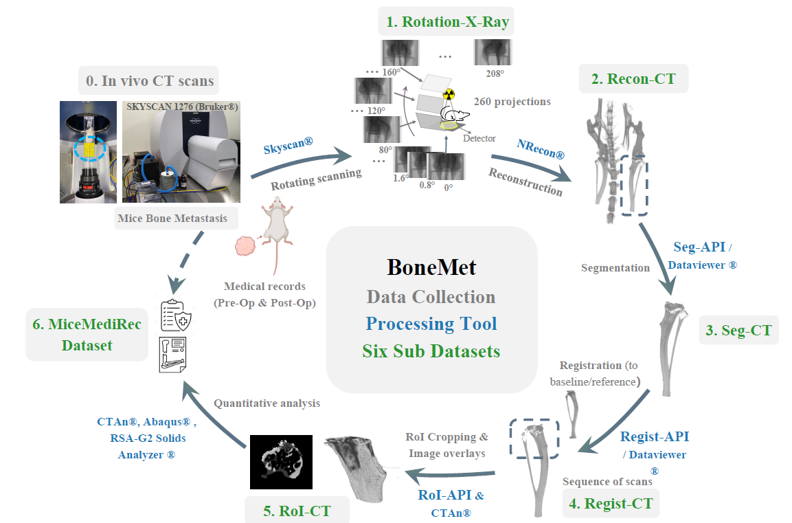
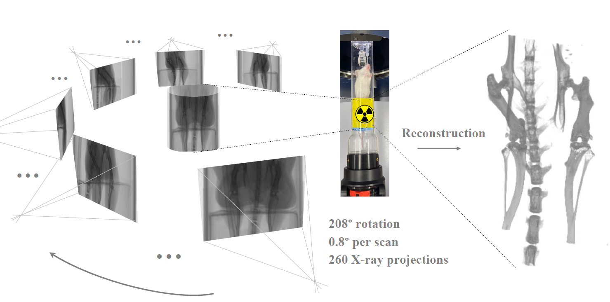
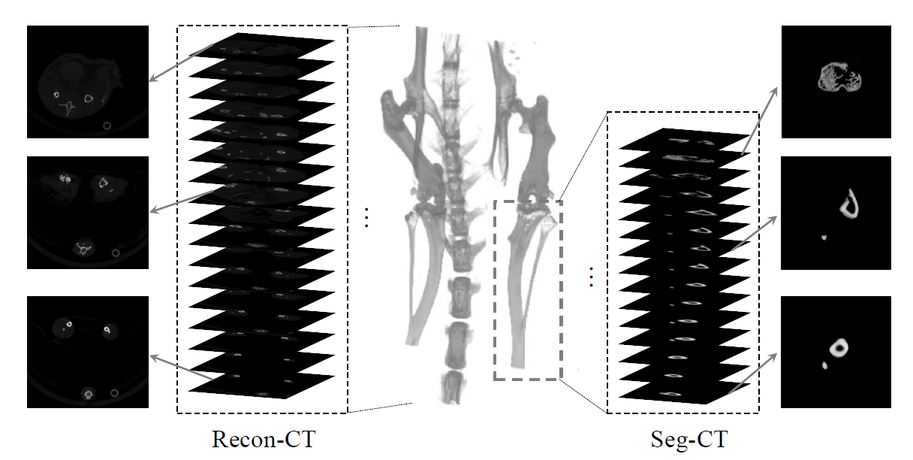
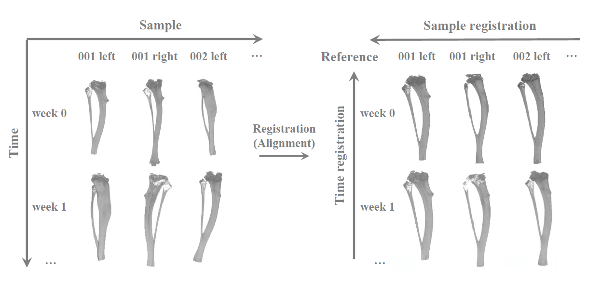
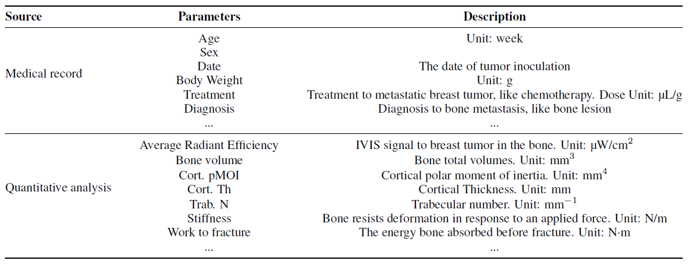

# BoneMet: An Open Large-Scale Multi-Modal Dataset for Breast Tumor Bone Metastasis Diagnosis and Prognosis




The Breast Tumor Bone Metastasis (BoneMet) dataset, the first large-scale, publicly available, high-resolution medical resource specifically targeting BTBM for disease diagnosis, prognosis, advanced image processing, and treatment management. It offers over 50 terabytes of multi-modal medical data, including 2D X-ray images, 3D CT scans, and detailed biological data (e.g., medical records and bone quantitative analysis), collected from thousands of mice spanning from 2019 to 2024. Our BoneMet dataset is well-organized into six components, i.e., Rotation-X-Ray, Recon-CT, Seg-CT, Regist-CT, RoI-CT, and MiceMediRec. Thanks to its extensive data samples and meaningful our tireless efforts of image processing, organization and data labeling, %this dataset BoneMet can be readily adopted to build versatile, large-scale AI models for managing BTBM diseases, which have been validated by our extensive experiments via various deep learning solutions either through self-supervised pre-training or supervised fine-tuning. To facilitate its easy access and wide dissemination, we have created the BoneMet package, providing three APIs that enable researchers to (i) flexibly process and download the BoneMet data filtered by specific time frames; and (ii) develop and train large-scale AI models for precise BTBM diagnosis and prognosis.


## Contributions

#### The `BoneMet` dataset

- The first *terabyte-sized* and publicly available breast tumor Bone Metastasis(BoneMet) dataset, a collection of high-resolution, well-organized multi-angle rotational X-ray and CT images accompanied by detailed biological data for breast tumor bone metastasis diagnosis and prognosis. 

- The `BoneMet` dataset is available at [Hugging Face](https://huggingface.co/datasets/BoneMet/BoneMet)

#### The `BoneMet` package 

- A Python package including three types of APIs: (1) CT Image Segmentation, (2) CT Image Registration, and (3) RoI-based CT Image Cropping at the Python Package Index(PyPI), for public release to facilitate our dataset’s ease access

- The `BoneMet` package is available at [Python Package Index (PyPI)](https://pypi.org/project/BoneMet)


<!-- ## Tutorials

The tutorials for the BoneMet dataset are available at Google Colab, with their links listed below

- [Sentinel-2 Imagery Tutorial](https://colab.research.google.com/drive/1Tj69JdhO7aX8ks-4UWYvHrFm9GB1PNCd?usp=sharing)
- [WRF-HRRR Computed Dataset Tutorial](https://colab.research.google.com/drive/14l-JSNHtelawNu3kVG_ukTd2WUJpaZEc?usp=sharing)

- [USDA Crop Dataset Tutorial](https://colab.research.google.com/drive/1U-vFoRyLSb2l2Q67LeGbkUKTeRaHDkkK?usp=sharing)
 -->


## The BoneMet Dataset

0ur BoneMet dataset is dataset is well-organized into six key components: Rotationa X-Ray Imagery(Rotation-X-Ray), Reconstructed CT Imagery (Recon-CT), Segmented CT Imagery(Seg-CT), Registered CT Imagery (Regist-CT), Region of Interest CT Imagery (RoI-CT), and Mice Medical Records (MiceMediRec), spanning from 2019 to 2024 (i.e., 5 years) across  over 50 terabytes of multi-modal medical data, including 2D X-ray images, 3D CT scans, and detailed biological data (e.g., medical records and bone quantitative analysis), collected1 from thousands of mice.

<!--  -->


### Rotation-X-Ray

The Rotational X-Ray Imagery consists of 651,300 X-ray images of subjects with tumors and 676,000 X-ray images of subjects without tumors. Each image has a resolution of 4,032x4,032x1 pixels and a spatial resolution of 0.8°, captured at the hindlimb. This dataset has been aligned both spatially and temporally with the temporal resolution of 1 week, and it offers 2D X-ray images taken from multiple angles, from anterior (front) to lateral (side) and posterior (back) views,providing a comprehensive examination of the subject. The total size of this imagery is 20.93 TB. Examples of our Rotation-X-Ray are shown below. Left: 2D X-ray images are taken from 260 variable angles with 0.8° intervals of the hindlimb of a mouse; and Right: The paired 3D CT scan is reconstructed from these 2D X-ray images.




### Recon-CT & Seg-CT

The Rotational X-Ray Imagery consists of 651,300 X-ray images of subjects with tumors and 676,000 X-ray images of subjects without tumors. Each image has a resolution of 4,032x4,032x1 pixels and a spatial resolution of 0.8°, captured at the hindlimb. This dataset has been aligned both spatially and temporally with the temporal resolution of 1 week, and it offers 2D X-ray images taken from multiple angles, from anterior (front) to lateral (side) and posterior (back) views,providing a comprehensive examination of the subject. The total size of this imagery is 20.93 TB.  

These 3D CTs of tibiae are isolated from the 3D CT scans of hindlimb in the Recon-CT imagery, as illustrated on the right side of Figure 3. This component includes 3,005 segmented CT scans of subjects with tumors and 7,205 segmented CT scans of subjects without tumors. Each scan is composed of approximately 1,700±200 2D slices with an image resolution of approximately 700±50x900±80x1 pixels. The size of this dataset is 1.53 TB.

The figures show the 3D CT scans from the Recon-CT and the Seg-CT imagery. Left: 3D CT scans of hindlimbs in the Recon-CT imagery; and Right: 3D CT scans of segmented tibiae in the Seg-CT imagery. Notably, 3D CT scans are composed of 2D cross-sectional slices.




### Regist-CT

This Regist-CT dataset includes registered 3D CT scans of tibiae taken at various time points and from different animals, aligned to a reference. This component includes 3,005 registered CT scans of subjects with tumors and 7,205 registered CT scans of subjects without tumors. Each scan is composed of 1,538 2D slices with an image resolution of 509x539x1 pixels. The size of this dataset is 0.18 TB. The figures show the examples of registration process from the Seg-CT to Regist-CT imagery. Left is 3D CT scans from the Seg-CT imagery (i.e, w/o registration); and right is 3D CT scans from the Regist-CT imagery, which are registered relative to their vertically aligned reference at various time points and across different animals.




### RoI-CT

This imagery focuses on the proximal end sections of the registered tibiae, where the effects of metastasis are most pronounced. The RoI-CT imagery comprises 300 2D slices below the proximal tibia-fibula junction, with overlaid registered CT scans aligned to their baseline (week 0). In each 2D slice, light gray represents the reserved bone in the sequential scans, white indicates bone formation where non-bone pixels at week 0 later became bone, and dark gray signifies bone resorption where bone pixels at week 0 later became non-bone. This component includes 3,005 CT scans of the proximal end sections of registered tibiae with tumors and 7,205 CT scans of that without tumors. Each 2D slice has the image resolution of 509x539x1 pixels. The size of this dataset is 8.00 GB. The figure below shows the examples of 3D CT scans from the RoI-CT imagery, including the proximal end of tibiae without (Left) and with (Right) metastatic breast tumors.


### MiceMediRec

The Mice Medical Records includes the number of mice of 501 with tumor and of 520 without tumor and results from detailed medical records such as experiment date, animal ID, age, body weight, mouse strain (or genotype), sex, and specific metastatic tumor sites, and quantitative analyses of bone from CTs, FE simulations, and mechanical testing, offering a comprehensive overview of the animals, bones, and their disease conditions. The size of this dataset is 9.44 MB. The details of MiceMediRec Dataset is shown in the table below.




### The BoneMet Package

In addition to our BoneMet dataset, we also develop the BoneMet package, including three types of APIs: i.e., (1) CT Image Segmentation, (2) CT Image Registration, and (3) RoI-based CT Image Cropping, at the Python Package Index(PyPI), for public release to facilitate our dataset's ease access. The detials of three APIs and their usage examples are listed as follows:

- **CT Image Segmentation API**: This API provides a simple interface to segment the 3D Reconstructed CT (Recon-CT) images into separate CT scans for the spine, left tibia, left femur, right tibia, and right femur. It can handle individual or batched segmentation of the Recon-CT scans. The API reads the 3D CT scans, identifies the appropriate indices to split the images, and saves the segmented scans to the specified output paths. Given the time point (e.g., the week after tumor inoculation), the input folder path, and the output folder path, Figure \ref{list:Segmentation} exhibits how to utilize the CT Image Segmentation API to automatically segment the tibiae.

- **CT Image Registration API**: This API helps researchers with the tibia registration on Seg-CT dataset. It can handle individual or batched registration of the segmented tibiae CTs. The API loads the reference and target CT scans, performs initial transformation, and registers the target CT scan to the reference CT scan. Then the registered CT scan and the transformation are saved to the specific output folder. Given the time point (e.g., the week after tumor inoculation), the slices range of reference and target subjects, the input folder path, the reference folder path, and the output folder path, Figure~\ref{list:Registration} illustrates how to utilize the CT Image Registration API to automatically align the segmented tibiae.

- **RoI-based CT Image Cropping API**: This API provides a simple interface to crop the region of interest (tibia proximal end) on Regist-CT dataset. It can handle batched cropping of the Regist-CT dataset. The API reads the overlapped 3D Regist-CT composite processed by our python package, identifies the proximal tibia-fibular junction, selects appropriate indices to split the images, and saves the cropped to the specified output paths. Given the input folder path, the output folder path, and index of the first selected slice below the tibia-femoral junction, Figure~\ref{list:Cropping} demonstrates how to utilize the RoI-based CT Image Cropping API to automatically crop the proximal end of tibiae.


### Installation

Researchers and practitioners can install the latest version of BoneMet with the following commands:

```python
# Create and activate a conda environment
conda create -n BoneMet_api python=3.10
conda activate BoneMet_api

# Install the latest version of BoneMet
pip install BoneMet

# Slove the ecCodes library dependency issue
pip install SimpleITK
```


### BoneMet API Examples

- **Example 1: A CT Image Segmentation API Example for Tibiae Batch Segmentation**

  Given the time and ID, the following code presents how to utilize the **CT Image Segmentation API** to segment the left and right tibiae from the hindlimb in the Recon-CT dataset, either individually or in batches:

```python
    config = {
        "week": " week 0",
        "masterfolder": r"F:\Recon-CT\week 0",
        "masterout": r"F:\Seg-CT\week 0"
    }

    splitter = ReconCTSegmentation(config)

    # Split a single image
    input_folder = r"F:\Recon-CT\week 0\871"
    image_title = "871"
    splitter.split_image(input_folder, image_title, config["masterout"])

    # Split multiple images
    for folder in os.listdir(config["masterfolder"]):
        if folder[0:10] in [871, 872, 873, ...]:   
            input_folder = os.path.join(config["masterfolder"], folder)
            image_title = os.path.basename(folder)[0:12]
            splitter.split_image(input_folder, image_title, config["masterout"])
```


- **Example 2: A CT Image Registration API Example for Tibiae Batch Registration**

  Given the reference and location for alignment, the following code shows how to use the **CT Image Registration API** to obtain the Regist-CT data and store in the local machine in a user-friendly format, either individually or in batches:

```python
import os
import re
import SimpleITK as sitk
import concurrent.futures

    config = {
    "workspace": r"F:\Seg-CT\week 0",
    "outputdir": r"F:\Regist-CT\week 0",
    "refdir": r"F:\reference",
    "img_z_range": [None, None],
    "ref_z_range": [None, None],
    "initial_transform_angles": [np.pi * i / 16 for i in range(-16, 10)],
    "BASELINE_REG": True, # week 0 (True) or sequencial scans (False)
    }

    # Initialize the registration instance
    registration = CTRegistration(config)

    # Register a single CT scan
    input_folder = r"F:\Seg-CT\week 0"
    ct_id = "871 week 0 left tibia"
    week = 0
    output_folder = config["outputdir"]
    registration.register_ct(input_folder, ct_id, week, output_folder)

    # Register a batch of CT scans
    input_folder = r"F:\Seg-CT\week 0"
    ct_ids = ["871 week 0 left tibia", "871 week 0 right tibia", "872 week 11 left tibia", ...]
    week = 0
    output_folder = config["outputdir"]
    registration.batch_register(input_folder, ct_ids, week, output_folder)

```


- **Example 3: A RoI-based CT Image Cropping API Example for Using the Overlapped Regist-CT Data to Crop the Proximal End of Tibiae in a batch** 

The following code presents a example of tibiae proximal end cropping from overlapped Regist-CT dataset starting at the proxiaml tibia-fibula junction. The overlapped composites data is operated by our python tool -- mkcomposite.py:

```python
import os
import cv2
import numpy as np
from skimage import io

    config = {
   "foldername": "selected 300 slices below proximal Tibia-fibular junction",
   "first_slice_selected": "first slice selected",
   "last_slice_selected": "last slice selected",
   "first_slice_selected_below_t-f_junction": 0  # Index of the first selected slice below the tibia-fibular junction
    }

    # Initialize the RoICropper
    cropper = RoICompositeCropper(config)

    # Crop the RoI from CT images
    input_folder = r"F:\Regist-CT\Tibia w0w5composite"
    output_folder = os.path.join(input_folder, config["foldername"])
    first_slice_selected = config["first_slice_selected"]
    last_slice_selected = config["last_slice_selected"]
    first_slice_below_tf_junction = config["first_slice_selected_above_t-f_junction"]

    cropper.crop_roi(input_folder, output_folder, first_slice_selected, last_slice_selected, first_slice_below_tf_junction)
```


## License

BoneMet has a [Creative Commons Attribution-NonCommercial 4.0 International (CC BY-NC 4.0)](https://creativecommons.org/licenses/by-nc/4.0/) license.